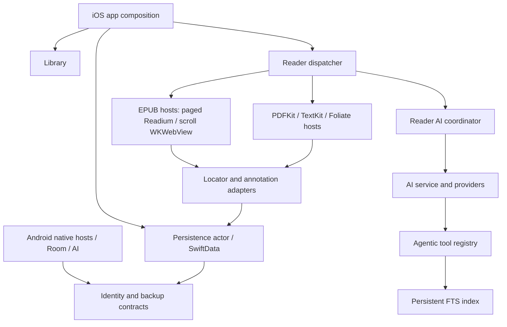

# AdaptiveReader repository audit

Date: 2026-10-03 (Asia/Shanghai). Baseline: `b996ab4d828a180ae4b23d0b07d045b3d318c34f`.

## Scope and evidence limits

This is a source-level architecture audit of the inherited fork, not a device-quality certification or an exhaustive security audit. Read surfaces include AGENTS.md, README.md, docs/architecture.md, project.yml, contracts/identity and conformance, .codex/config.toml, the workflow/version/isolation rules, and the implementation paths cited below. Test fixtures and relevant test sources were inspected. Native suites were attempted, but could not execute in this environment; see Validation.

No production code, existing renderer, dependency pin, data schema, or app behavior changes in this foundation. All target capabilities described below are proposals unless explicitly identified as existing.

## Existing architecture

| Concern | Verified implementation | Implication |
| --- | --- | --- |
| iOS composition | [VReaderApp](../../vreader/App/VReaderApp.swift), [ModelContainerFactory](../../vreader/App/ModelContainerFactory.swift), [PersistenceActor](../../vreader/Services/PersistenceActor.swift) | SwiftUI composition; live SchemaV10; persistence crosses actors via records rather than live models |
| Reader dispatch | [ReaderContainerView](../../vreader/Views/Reader/ReaderContainerView.swift), [ReaderEngine.resolve / routeEPUB](../../vreader/Models/ReaderEngine.swift) | Native format hosts remain; EPUB paged + Readium flag routes to Readium, while scroll routes to legacy WKWebView even with the flag enabled |
| Readium EPUB | [ReadiumEPUBReaderViewModel](../../vreader/ViewModels/ReadiumEPUBReaderViewModel.swift), [ReadiumReaderCoordinator](../../vreader/Views/Reader/ReadiumReaderCoordinator.swift), [ReadiumEPUBHost](../../vreader/Views/Reader/ReadiumEPUBHost.swift) | Publication opening, native navigator, position save/restore, and script/delegate seams already exist |
| Legacy EPUB | [EPUBParser](../../vreader/Services/EPUB/EPUBParser.swift), [EPUBParserProtocol](../../vreader/Services/EPUB/EPUBParserProtocol.swift), [EPUBContinuousScrollCoordinator](../../vreader/Views/Reader/EPUBContinuousScrollCoordinator.swift) | Lazy ZIP-backed chapter access and bounded chapter stitching; do not replace with eager whole-book rendering |
| PDF | [PDFReaderViewModel](../../vreader/ViewModels/PDFReaderViewModel.swift), [PDFTextExtractor](../../vreader/Services/Search/PDFTextExtractor.swift) | PDFKit reader and page-text extraction exist; page text is not a semantic reading-order / figure / table extractor |
| Original position | [Locator](../../vreader/Models/Locator.swift), [VReaderLocator](../../vreader/Models/VReaderLocator.swift), [PersistenceActor+ReadingPosition](../../vreader/Services/PersistenceActor+ReadingPosition.swift) | Existing format locations and authoritative Readium JSON envelope must be retained |
| Annotations | [AnnotationAnchor](../../vreader/Models/AnnotationAnchor.swift), [ReadiumDecorationHighlightAdapter](../../vreader/Services/Reader/ReadiumDecorationHighlightAdapter.swift) | EPUB DOM ranges, PDF normalized rectangles, text UTF-16 ranges; existing annotations are not disposable semantic caches |
| Search | [SearchTextExtractor / TextUnit](../../vreader/Services/Search/SearchTextExtractor.swift), [EPUBTextExtractor](../../vreader/Services/Search/EPUBTextExtractor.swift), [PersistentSearchIndex](../../vreader/Services/Search/PersistentSearchIndex.swift) | FTS5 search has reusable infrastructure, but flattened TextUnit text loses exact DOM structure |
| AI transport | [AIService](../../vreader/Services/AI/AIService.swift), [AIProvider](../../vreader/Services/AI/AIProvider.swift), [ResolvedAIProviderConfig](../../vreader/Services/AI/ResolvedAIProviderConfig.swift) | Actor service with feature/consent/key gates; immutable provider snapshot supports multi-request operations |
| AI context | [ReaderAICoordinator](../../vreader/Views/Reader/ReaderAICoordinator.swift), [AIContextExtractor](../../vreader/Services/AI/AIContextExtractor.swift), [ChatContextAssembler](../../vreader/Services/AI/ChatContextAssembler.swift) | Scope extraction, budget enforcement, annotation context, and provenance exist; strict future-content exclusion does not |
| Agentic search | [SearchCurrentBookTool](../../vreader/Services/AI/Tools/SearchCurrentBookTool.swift), [AgenticToolRegistryBuilder](../../vreader/Services/AI/Tools/AgenticToolRegistryBuilder.swift) | Current-book search is book-scoped but has no reading-boundary input; broad content/library tools are also registered |
| Android | [ReaderActivity](../../android/app/src/main/kotlin/com/vreader/app/reader/ReaderActivity.kt), [AiClient](../../android/app/src/main/kotlin/com/vreader/app/ai/AiClient.kt), [VReaderDatabase](../../android/app/src/main/kotlin/com/vreader/app/data/VReaderDatabase.kt), [android/settings.gradle.kts](../../android/settings.gradle.kts) | Native Kotlin/Compose app and :identity module are already present; Room database version is 10 |
| Cross-device identity | [contracts/README](../../contracts/README.md), [identity/DECISION](../../contracts/identity/DECISION.md), [Book.sourceCanonicalKey](../../vreader/Models/Book.swift) | Existing versioned fingerprint, locator, translation-cache and backup contracts constrain new semantic identities |

The original advice that EPUB always uses Readium needs qualification: layout-aware routing explicitly keeps continuous-scroll EPUB on the legacy renderer. The current app also uses SchemaV10, rather than the README tech-table's older SchemaV6 claim. The Android ADR's historical “not yet started” status is not the present source state ([ADR-0001](../decisions/0001-android-port-strategy.md), Android paths above).

## Current system diagram

Arrows describe composition/data access, not a new domain dependency contract. Platform implementations remain separate; their shared surface is the contract corpus.

## Reuse, preservation, extension, replacement

| Action | Components | Reason / entry point |
| --- | --- | --- |
| Reuse | EPUBParserProtocol chapter access, DocumentFingerprint, immutable records, AIService/provider config, FTS storage, feature flags | Already tested seams, source locations, gated transport; [EPUBParserProtocol](../../vreader/Services/EPUB/EPUBParserProtocol.swift), [FeatureFlags](../../vreader/Services/FeatureFlags.swift) |
| Preserve | Reader routing, continuous-scroll window, original positions/highlights, import/conversion, backup identity and platform schemas | Mature behavior is outside semantic extraction scope; [ReaderEngine](../../vreader/Models/ReaderEngine.swift), [AnnotationAnchor](../../vreader/Models/AnnotationAnchor.swift), [backup-format](../../contracts/identity/backup-format.md) |
| Extend later | Reader location/selection adapters, scoped context assembly, disclosure/citations, feature flags, per-book caches | Introduce semantic lookup and assistance behind opt-in seams; [ReaderAICoordinator](../../vreader/Views/Reader/ReaderAICoordinator.swift), [ChatCitation](../../vreader/Services/AI/ChatCitation.swift) |
| Add | SemanticDocument, deterministic EPUB DOM extraction, source-to-semantic text map, structural reading boundary, layout policy | No corresponding SemanticDocument/SourceAnchor/adaptive-layout implementation found in vreader/, android/app/src/main/, or contracts/ at this baseline |
| Replace within new path only | Regex stripping as semantic extraction; unconstrained FTS tool as spoiler-safe retrieval; progression-only inferred text offsets | [EPUBTextExtractor.stripHTML](../../vreader/Services/Search/EPUBTextExtractor.swift) destroys structure; [SearchCurrentBookTool.run](../../vreader/Services/AI/Tools/SearchCurrentBookTool.swift) receives no cutoff. Keep existing legacy behavior while introducing an independently gated path |
| Defer replacement | Entire classic renderer, PDFKit, platform-native shell, search UI, sync storage | No evidence that wholesale replacement is necessary; preserve the native-platform strategy in [ADR-0001](../decisions/0001-android-port-strategy.md) |

## Technical risks and corrections

1. **Semantic source fidelity:** heading/list/image relationships cannot be reconstructed exactly from regex-flattened search text. Build from the original chapter bytes/XHTML and preserve a reversible text-to-node map. EPUBParserProtocol returns only String, and EPUBParser tries UTF-8 then Latin-1 without reporting the chosen encoding; its filename/size/mtime extraction cache is not source-fingerprint verification. The semantic path needs an independent raw-resource reader with explicit byte digest, encoding, resource limits and stale-cache detection. Do not reinterpret existing search offsets as DOM offsets ([EPUBTextExtractor](../../vreader/Services/Search/EPUBTextExtractor.swift), [EPUBParserProtocol](../../vreader/Services/EPUB/EPUBParserProtocol.swift), [EPUBParser](../../vreader/Services/EPUB/EPUBParser.swift)).
2. **DOM changes invalidate naive CFIs:** injected translations, wrappers, or notes change the displayed tree. SourceAnchor must reference the original tree, retain original href and quote context, and classify resolution precision; missing CFI must remain missing rather than fabricated ([AnnotationAnchor](../../vreader/Models/AnnotationAnchor.swift), [identity/locator](../../contracts/identity/locator.md)).
3. **Current scope names overstate spoiler safety:** AIContextExtractor's section is centered around the position and chapter scope can include the whole chapter; book-so-far without UTF-16 offsets falls back to the full flattened text. ReaderAICoordinator can fall back from an empty scoped result to a centered section. ChatContextScope's comment claiming every non-whole-book scope is safe is therefore not a valid guarantee ([AIContextExtractor](../../vreader/Services/AI/AIContextExtractor.swift), [ReaderAICoordinator.scopedChatContext](../../vreader/Views/Reader/ReaderAICoordinator.swift), [ChatContextScope](../../vreader/Services/AI/ChatContextScope.swift)). This is an identified design gap, not a change made here.
4. **Tool bypass:** search_current_book has no cutoff and get_book_content can return unrestricted content. Strict assistance must use a separately assembled, policy-enforcing registry. Prompt wording cannot repair this ([AgenticToolRegistryBuilder](../../vreader/Services/AI/Tools/AgenticToolRegistryBuilder.swift), [GetBookContentTool](../../vreader/Services/AI/Tools/GetBookContentTool.swift)).
5. **Position is not character percentage:** a renderer's progression does not certify which words have been read. Exact structural ranges, conservative known prefixes, and unknown-position handling are needed ([Locator](../../vreader/Models/Locator.swift), [contracts/identity/locator](../../contracts/identity/locator.md)).
6. **Large books:** the parser loads chapters on demand, while the current search extractor accumulates text units. New extraction must publish bounded sections and cancellation points, not materialize every chapter at reader launch ([EPUBParser](../../vreader/Services/EPUB/EPUBParser.swift), [EPUBTextExtractor.extractFromParser](../../vreader/Services/Search/EPUBTextExtractor.swift)).
7. **Layout feasibility:** no Pretext integration exists. Readium script seams do not prove that its pagination, CFI, selection, TTS and decoration lifecycle tolerate arbitrary replacement DOM. Prototype separately and require real-device parity before promotion ([ReadiumReaderCoordinator](../../vreader/Views/Reader/ReadiumReaderCoordinator.swift), [ReaderEngine.routeEPUB](../../vreader/Models/ReaderEngine.swift)).
8. **PDF reconstruction:** PDFTextExtractor only collects page.string; no reliable reading order, OCR, figures, captions or formula extraction is established. Keep original PDF view and expose extraction uncertainty ([PDFTextExtractor](../../vreader/Services/Search/PDFTextExtractor.swift)).

## Dependency and license inventory risks

The fork describes itself as MIT in [README](../../README.md), but no root LICENSE file is tracked at the audited revision. [project.yml](../../project.yml) pins Readium Swift 3.9.0; [Package.resolved](../../vreader.xcodeproj/project.xcworkspace/xcshareddata/swiftpm/Package.resolved) also contains transitive packages. Android dependencies are declared in [app/build.gradle.kts](../../android/app/build.gradle.kts) and its root build files; do not infer linked components from product names alone.

Vendored [libmobi/src/mobi.h](../../vreader/Services/Libmobi/src/mobi.h) declares LGPL-3.0-or-later. [BUILD-RECIPE](../../vreader/Services/Libmobi/BUILD-RECIPE.md) says a LICENSE is retained, but that named license file is absent from the tracked tree. Foliate sources and bundle live under [Services/Foliate/JS](../../vreader/Services/Foliate/JS); its package.json is a build-tool manifest, not a complete attribution inventory. Font license files are tracked under [Resources/Fonts](../../vreader/Resources/Fonts).

Before distribution, perform a source-and-binary dependency/notice inventory and resolve those missing evidence files with the upstream owner. This audit records source evidence and gaps; it does not certify distribution compliance. No dependency update or license substitution is included.

## Migration and cross-platform risks

- SchemaV10 is initialized in [VReaderApp](../../vreader/App/VReaderApp.swift), registered through [SchemaV1/VReaderMigrationPlan](../../vreader/Models/Migration/SchemaV1.swift), and includes converted-Kindle source identity via [Book.sourceCanonicalKey](../../vreader/Models/Book.swift). Do not introduce semantic tables into the existing migration history in the first phase.
- Cross-platform converted-Kindle identity uses source bytes; rendered EPUB fingerprints are platform-local. Preserve both identities when generating derived semantic artifacts; historical implementation-status prose in [DECISION](../../contracts/identity/DECISION.md) must be compared with current import and migration code before any identity rewrite.
- Semantic cache invalidation is not annotation deletion. Existing [Highlight](../../vreader/Models/Highlight.swift), [Bookmark](../../vreader/Models/Bookmark.swift), and saved locators keep their source identity. Later AI notes require durable source anchors independent of parser-version-specific semantic IDs.
- New shared wire contracts must use the additive/breaking conformance gate in [contracts/README](../../contracts/README.md). A Swift-only prototype cannot claim Android equivalence. Windows has no implemented client in this audited reader architecture.

## Concurrency and persistence risks

Existing boundaries provide useful precedents: actor-isolated EPUBParser, actor-isolated AIService/PersistenceActor, and MainActor-owned ReadiumEPUBReaderViewModel/ReadiumReaderCoordinator. Reuse those patterns rather than passing Publication, WKWebView, PDFDocument or SwiftData models into Sendable domain state (source links in the architecture table).

New workers must guard actor reentrancy after every suspension: a closed/reopened book, parser revision change, cancelled extraction, provider switch or consent revocation must not publish stale results. Bound extraction concurrency; a chapter cache shared with legacy rendering needs explicit ownership or a separate extraction store. Serialize cache publication via temporary files + atomic rename; recheck session/revision tokens before installation. These are proposed mitigations, not properties of new code already implemented.

## Recommended module boundaries and order

1. Deterministic SemanticDocument / SourceAnchor / source text maps, with original EPUB chapters and no reader UI changes.
2. Conservative reading-boundary resolution and a retrieval policy applied to all context, chunks, notes, histories, summaries and tools. This precedes the first assistance feature, rather than following BookModel.
3. CSS-first layout prototype on semantic fixtures, then source navigation/selection/highlight/TTS parity against real EPUBs. Pretext is optional measurement support, not the author of canonical content.
4. Six explicit assistance intents through one orchestration service; reuse AIService transport, preserve source disclosure, and enable only after boundary tests pass.
5. Versioned derived BookModel and explicit ReaderModel preferences; avoid unsupported profiling from dwell time.
6. Explicit friction feedback first; passive signals after observed user benefit.
7. PDF semantic extraction with confidence and original-page return; adaptive PDF rendering only after extraction quality gates.
8. Android semantic contract parity and shared browser layout bundle; Windows client as a separate delivery decision.

Dependency details are specified in [01-target-architecture](01-target-architecture.md); first code scope in [02-semantic-document-plan](02-semantic-document-plan.md).

## Validation

| Check | Observed result | Interpretation |
| --- | --- | --- |
| Git baseline/status | HEAD matches baseline; initial main worktree clean | Audit sources fixed to one revision |
| iOS before audit: `bash scripts/run-tests.sh` | Exit 2, `RUN-TESTS RESULT: NO_BOOTED_SIM`; xcrun/xcodebuild/Swift/XcodeGen unavailable on Linux | Blocked; no XCTest methods executed |
| Android before document edits: `TIMEOUT_SECS=60 ANDROID_CMD='cd android && ./gradlew :identity:test --console=plain --no-daemon' bash scripts/run-android-tests.sh` | Exit 1; Gradle 8.14.4 download throws `java.net.SocketException: Network is unreachable` | Environment bootstrap blocked; no identity tests executed |
| Hosted CI inventory | At baseline `.github/` tracks CODEOWNERS only; no workflow YAML | Cannot claim automatic macOS validation from the fork |
| Test source inventory | 719 tracked files under vreaderTests, including 694 Swift files; 206 tracked files under android/app/src/test + android/identity/src/test | File counts only, not passed-test counts |
| After document edits | See [foundation review](03-foundation-review.md) | Docs review and local integrity checks do not substitute for native suites |

Raw command evidence is embedded here rather than referring to ephemeral system logs. Prior upstream verification logs are historical evidence, not fresh verification of this fork.
