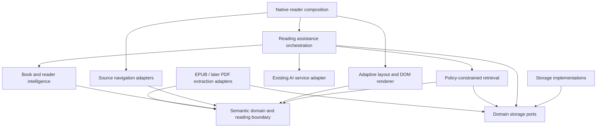

# AdaptiveReader target architecture — proposal

Status: proposed; no runtime capability is implemented by this document. Baseline and existing-path evidence: [repository audit](00-repository-audit.md).

## Product contract

Help the reader understand the source while keeping original content, source navigation, annotations, offline reading, and classic rendering intact. Separate understanding from presentation: reading assistance chooses explanatory context; layout chooses its display. Neither alters canonical book content.

Preserve the native iOS/Android strategy in [ADR-0001](../decisions/0001-android-port-strategy.md). Share versioned semantic contracts, conformance vectors and a future browser layout bundle rather than attempting to run Swift services on Android. Windows remains a future shell/backend decision; an embeddable browser renderer alone is not a complete Windows reader.

## Dependency direction



Arrows mean imports/dependencies. Semantic domain imports no reader UI, Readium, WebKit, PDFKit, SwiftData, networking, or LLM SDK. Foundation value types are allowed in the Swift implementation. Composition injects implementations of domain ports. Format enums/anchor variants are permitted as data; domain algorithms do not branch on PDF page assumptions or toolkit objects.

Initial implementation is folders/value types within the existing app target, not a premature package migration. Future extraction into a Swift package is a separate decision requiring build evidence.

| Boundary | Owns | Does not own |
| --- | --- | --- |
| Reader Core | Existing hosts, original positions, selection, lifecycle, navigation, TTS | LLM prompts or semantic truth |
| Semantic Document | Source revision, sections/blocks/runs, source maps, references, diagnostics | Renderer coordinates, provider state, device types |
| Adaptive Layout | Deterministic layout constraints, CSS policy, measurement adapter, presentation plan | Changing source text or deciding factual explanation |
| Book Intelligence | Derived concepts/relations/summaries with evidence ranges and generator versions | Canonical book content |
| Reader Intelligence | Explicit familiarity/preferences/goals and evidence history | Intelligence/personality scores inferred from behavior |
| Retrieval | Source boundary enforcement, eligible chunks, evidence budget and citations | Trusting model-requested scope changes |
| AI Orchestration | Assistance intents, context construction, provider snapshot, cancellation, typed result validation | View lifecycle or direct DB models |
| Persistence | Derived caches and durable note/profile repositories via ports | UI widgets or raw framework objects in domain values |

## Semantic identity and source location

Proposed value contract (not existing types):

- **DocumentRevision:** platform-local render fingerprint plus optional sourceCanonicalKey, semantic schema version, extractor version, and per-resource byte digest. Source-key presence is explicit; never fabricate the original Kindle source hash.
- **SemanticDocument:** revision, metadata, ordered section descriptors and extraction coverage. Section bodies load independently; incomplete coverage is first-class.
- **SemanticSection:** spine occurrence identity, original href, hierarchy/heading relationships and ordered block bodies. Reading order follows OPF spine order; nav/NCX is metadata, not a replacement ordering algorithm.
- **SemanticBlock:** header plus heading, paragraph, figure, caption, quote, list, or opaque-source payload; later table/formula/code/footnote types. Nested structures retain children without flattening their text twice.
- **SemanticID:** deterministic hash of a versioned, length-delimited identity tuple `(renderFingerprint, extractorVersion, spineOccurrence, resourceDigest, originalNodePath, fragmentOrdinal, kind)`. Stable for identical bytes and the same extractor version, distinct for duplicate prose; NOT stable across book edits or parser upgrades. Re-extraction invalidates derived semantic IDs without deleting source-anchored user notes.
- **SourceAnchor:** document identity and a typed original-source selector, quote/context, and resolution precision. EPUB selector: OPF-relative original href, spine occurrence, original DOM node path and UTF-16 text-node ranges, optional actual CFI and optional opaque Readium locator JSON. A block can contain several source spans. Original serialized DOM paths/locators remain separate from paths in re-rendered DOM.
- **SourceTextMap:** piecewise mapping from normalized semantic text runs to original text-node UTF-16 spans. Entity decoding, collapsed whitespace, soft breaks, combining characters and removed non-content nodes cannot be represented by one constant offset. Return exact, approximate, ambiguous or unresolved outcomes rather than choosing an arbitrary repeated quote.
- **SemanticOrder:** lexicographic `(spineOccurrence, blockOrdinal, offsetUTF16)`, scoped to a revision. No numeric comparison of CFI strings or rounded display progress.

Serialization canonicalizes only fields whose contract allows it; preserve opaque href/CFI/Readium JSON for navigation. Semantic text may have a normalized search representation, but display/source text is never silently NFC-rewritten. Native float rectangles are represented by plain numeric values with finite/bounds validation at adapter boundaries.

Later PDF selectors must include zero-based page, crop box, rotation, coordinate-space declaration, normalized source rectangles and original text spans; display pixels are never persisted. TXT/MD selectors use source-unit identity and original UTF-16 spans. A resolver can return a source page or coarse section when precision is insufficient, but cannot label that exact navigation.

## Proposed ports before implementations

The following Swift signatures are illustrative contracts for review, not compilable additions to the current target. Supporting input/result types are defined in the first implementation plan before code begins.

```swift
protocol SemanticSectionExtracting: Sendable {
    func extract(_ input: SemanticSectionInput) async throws -> SectionExtractionResult
}
protocol SemanticDocumentStoring: Sendable {
    func loadSection(_ key: SemanticSectionKey) async throws -> SemanticSection?
    func store(_ result: SectionExtractionResult, for key: SemanticSectionKey) async throws
}
protocol ReadingBoundaryResolving: Sendable {
    func resolve(_ snapshot: SourcePositionSnapshot,
                 in manifest: SemanticManifest) async throws -> BoundaryResolution
}
protocol PositionAwareRetrieving: Sendable {
    func retrieve(_ request: RetrievalRequest,
                  policy: RetrievalPolicy) async throws -> RetrievalResult
}
protocol ReadingAssisting: Sendable {
    func assist(_ request: AssistanceRequest) async throws -> AssistanceResponse
}
```

MainActor SourceNavigationRouting and DOM selection adapters are separate UI-layer ports; they resolve SourceAnchor to existing Locator/VReaderLocator and report precision. LayoutPolicy is a pure value function over semantic structure and LayoutEnvironment. Browser-only measurement/prepared handles remain inside its JS adapter, never inside a persisted domain object.

## Deterministic extraction and lifecycle

EPUB adapter owns its source session independently from reader-host ownership; do not run extraction against an injected bilingual or continuously stitched DOM. Existing EPUBParserProtocol is useful precedent for lifecycle/metadata, but its String-returning chapter method cannot supply original byte digest or encoding evidence. A new EPUBSemanticResourceReader returns bounded verified original entry bytes, decoding provenance and digest; its cache keys are source-revision-based, never the renderer's filename/size/mtime cache. Existing EPUBParserProtocol stays unchanged.

The resource spike must prove archive/entry count, compressed/uncompressed size, expansion ratio, duplicate-entry rejection, containment, actual decompressed-byte ceilings and cancellation. ZIPReader.entry/listEntries/extractData are existing candidate seams, not a guarantee of those limits: its decompressor can grow buffers and an advertised-size preflight alone cannot enforce a real output bound. Add a bounded semantic resource/decompression path if the current API cannot meet the contract. Preflight applies before any legacy open that extracts the first chapter. Reuse pure metadata parsers only after proving their behavior on bounded original container/OPF bytes. Unsupported encodings are reported, never silently claimed as correctly decoded source.

Use a real structural parser, not regex stripping. Parser selection is a recorded spike: the lockfile's transitive Fuzi pin does not prove an importable direct app dependency. A libxml2-backed option and an explicit DOM-library dependency must be compared for original text-node fidelity, recovery diagnostics, entity security, cancellation, build and license footprint. No external entities, network fetching or script evaluation during parsing. Malformed input may yield partial/opaque source blocks and explicit diagnostics; never call a repaired DOM offset exact without validating its source map.

Extraction order: source revision → spine manifest → bounded chapter load → structural DOM traversal → block/run/source mapping → deterministic validation → section publication. Empty sections retain an identity. Unsupported/ambiguous content retains source-backed opaque blocks, does not disappear. Images retain safe original resource references, alt text, optional dimensions and captions; no AI semantic importance judgment in Phase 1. Fixed-layout EPUB remains source-only and is ineligible for adaptive reflow initially.

Async workers publish only when the captured document/session revision is still active. A single worker per cache key, cooperative cancellation between bounded parse units, limited concurrent sections, and a size-bound LRU prevent large-book spikes. Binary assets stay external. Never eagerly parse a million-word book when opening one paragraph.

## Reading boundary and spoiler-safe retrieval

Reading progress is an interaction signal, not proof of actual comprehension. The policy limits disclosure to a configured source cutoff. Default assistance uses the conservative current cursor/explicit selection boundary; furthest-observed position or previously-read intervals are separate opt-in policies, not silently used when a reader moves back.

**Strict policy requires a resolved boundary.** Unknown/ambiguous location returns insufficientContext, or only a user-selected passage plus verified prior ranges. It must not fall back to the whole book or a centered window. A selection extending ahead requires explicit user intent and is identified as selected source content.

For strict mode:

1. Every chunk carries revision, SemanticID, start/end source-order coordinates and a source map. Eligible chunks must end at/before the cutoff. A crossing chunk is clipped with a verified source map or excluded.
2. Enforce eligibility in the retrieval backend before building snippets, reranking, counting results or exposing titles/section metadata. Whole-chapter FTS snippets must not leak a forbidden sentence even when their hit begins earlier.
3. Apply the same policy to summaries, concept/argument graphs, annotations, note text, cached answers, tool outputs and previous chat turns. A summary with evidence extending into future content is excluded; a whole-book graph node is not safe merely because its label occurs earlier.
4. Source ranges alone do not establish that a user's note is safe: it may discuss the ending while anchored to the first page. Strict mode excludes free-form notes/chat histories and unbounded generated answers unless their content was created under, and is still valid for, the same-or-earlier policy. An explicit unrestricted inclusion changes the policy and must be disclosed.
5. Build a strict tool registry; do not use the inherited unrestricted registry. Unknown/new tools are denied until their executor enforces the policy. Cross-book content is off by default for this mode and needs a separately defined disclosure scope.
6. Pin the context/policy snapshot for the request. Stale responses cannot be installed into a different book/revision/scope. Cancellation and consent revocation propagate through all turns.

Cache keys include revision, boundary/scope, intent, selected source range, reader preference revision, prompt version, provider/model identity and evidence digest. Never persist API keys in those keys. Provider configuration pins a credential snapshot only in transport memory; new orchestration reuses AIService's gated `sendRequest(_:using:)` seam rather than its provider-unaware legacy response cache.

This structurally controls what book material is supplied. It cannot guarantee that a pretrained model never recalls an ending from its own knowledge; instruct the model to remain grounded, constrain answer evidence, and present unsupported claims as uncertainty. Do not market structural retrieval as an absolute model-level no-spoiler guarantee.

## Assistance and derived intelligence

ReadingAssistanceIntent contains simplify, explainWhy, background, example, connectPrevious, lostHere. One ReadingAssistanceEngine snapshots source ranges, policy, goal and preferences; obtains eligible evidence; calls an AIService adapter; validates a typed response; returns explanation, evidence citations, uncertainty, generation provenance and request token. Views render that value. LLM JSON is validated advice, never SemanticDocument state.

BookModel stores derived concepts, relations and summary layers keyed by source revision, prompt/model version and exact evidence ranges. It can be rebuilt without losing source or user annotations. ReaderModel initially stores explicit goals/preferences and transparent familiarity evidence; asking for an example does not deterministically prove ignorance. Friction starts with the explicit lostHere event; passive dwell/backtracking is not an automatic intervention trigger in the MVP.

## Adaptive layout

CSS/DOM is the first renderer: semantic blocks produce sanitized accessible HTML, one continuous logical text flow, source attributes and selection/source mapping. LayoutEnvironment includes available content width, effective font size/line height, script/direction, zoom, image intrinsic dimensions and accessibility settings; device names are not breakpoints.

Figures use block by default. Float only when the remaining line width passes a readable minimum for the active typography and the figure stays near its semantic reference. Technical tables/formulas/core diagrams retain enough width or use a dedicated source view. Captions move with their figure; do not crop essential figure content. Large text, narrow split-view, font substitution or a failed measurement returns to block layout.

Annotation presentation: compact marker with user-expanded inline content on narrow surfaces; bounded margin notes with overflow/collision rules on wide surfaces. An annotation and its source identity do not change with presentation. Responsive reflow preserves the viewport using SemanticID/source offset, not pixel position.

[Pretext's official README](https://github.com/chenglou/pretext) documents prepare/layout, per-line width iteration and rich-inline measurement. It is an optional measurement adapter to evaluate candidate layouts after fonts are ready. It does not itself supply book semantics, margin-note collision resolution, pagination, widow/orphan policy or a full ebook renderer; those remain app policies. Cache prepared measurement by text/font/options and invalidate on font loading or typography changes. Benchmark DOM agreement on CJK, RTL, ligatures and WebView versions before using measurement results to place source text.

Keep the classic renderer available and unchanged by default. A separate adaptive DOM host is safer to prototype than replacing Readium's inner DOM without proving locator/selection/highlight/search/TTS/accessibility parity. Final integration choice requires an ADR backed by device measurements, not an assumption that injecting JS makes arbitrary layout safe. A WebView bundle can later be shared across iOS/Android/Windows while platform lifecycle/asset security/navigation stay native.

## Ownership, concurrency and persistence

| Resource | Owner / isolation | Publication contract |
| --- | --- | --- |
| Native navigator, WebView, PDF view, observable UI state | MainActor / Android main dispatcher | Snapshot plain Sendable/immutable DTOs before background work |
| Original chapter extraction | Actor-scoped parser session; bounded workers | No sharing reader-owned close/open lifecycle; cancellation + generation checks |
| Derived semantic sections | Dedicated cache actor | Revision-keyed atomic publication; corruption drops cache, not source |
| AI requests | Existing AIService + orchestration task | Immutable provider/context snapshots; live consent gate; stale response token rejection |
| User notes/preferences | Durable repository port | Independent from regenerated semantic IDs; versioned additive storage when introduced |
| Existing book data | Existing PersistenceActor / Android Room | No mutation of current schema in Phase 1 |

Phase 1 is in-memory. Later disposable sections belong in a separate versioned on-disk cache; durable AI notes need an additive, audited persistence/backup design. The existing source-backed annotation models remain authoritative. Unsupported future cache schema versions are rejected and regenerated; durable note schemas need explicit migrations and source-anchor fallback.

## Tests, flags and migration

- Domain tests: deterministic IDs, encoding validation, range order, source map round trips and incomplete coverage.
- EPUB adapter tests: real structural fragments, malformed input, ambiguous/repeated text, image/caption relations, Unicode/CJK/RTL, path safety, cancellation and large chapters.
- Retrieval integration tests: crossing chunks, unknown positions, forward/backward cursor movement, future annotations/summaries/history/tools, scope/provider switches, cache collisions and failure modes.
- Renderer tests: selection-to-source return, font/viewport changes, note collisions, reading-order accessibility and classic/adaptive handoff. Native behavior requires device validation, not only JS snapshot tests.
- Cross-platform conformance: versioned vectors for SemanticID inputs, source-order ranges, anchor encoding and diagnostics. Existing identity vector gate continues unchanged.

Proposed flags: semanticExtraction, strictReadingAssistance, adaptiveEPUBLayout, pdfSemanticReflow — independent, default off and injected into consumers. No existing Readium/continuous-scroll flag is repurposed. Flag-off introduces no extraction task or schema migration; turning off a feature does not delete notes.

No app rename, bundle-ID change, source directory move, legacy data migration or dependency upgrade is part of this foundation. Use existing sourceFingerprint/sourceCanonicalKey mappings instead of changing book identity to fit semantic caching.

## Implementation order and ADR proposals

| Stage | Deliverable | Hard dependency / exit bar |
| --- | --- | --- |
| 1 | Deterministic EPUB semantic values + source mapping | Audited parser choice; RED/GREEN domain/extraction tests; classic path untouched |
| 2 | Source navigation adapter + conservative boundary | Demonstrated source round-trip; ambiguous positions fail closed |
| 3 | Policy-scoped chunks and retrieval | No future source in any input/tool/history/cache integration test |
| 4 | Layout experiment + six-intent assistance | Can run separately after semantic/boundary foundations; UI requires committed approved design, existing repo rule 51 |
| 5 | BookModel / ReaderModel / explicit friction | Evidence provenance and useful observed feedback; no automatic profiling |
| 6 | PDF extraction then reflow | Reading-order/confidence quality set, source-page return, original PDF retained |
| 7 | Android parity / Windows delivery | Contract conformance and independent platform verification |

Record decisions in the existing docs/decisions directory, following its numbering rather than creating a competing ADR registry: semantic domain identity, source mapping/precision, strict retrieval scope, CSS/Pretext integration, derived-vs-durable persistence, PDF fidelity, and platform delivery. They are proposals until reviewed and accepted; this document does not silently accept them.
